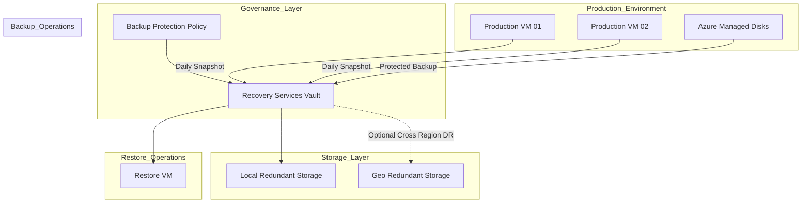

# 🛡️ Enterprise Azure Backup & Disaster Recovery Platform


Production-grade Azure Backup & Disaster Recovery implementation designed for enterprise infrastructure protection, ransomware resilience, backup governance and operational recovery workflows.

---

# 📌 Executive Summary

Designed and implemented enterprise-grade Azure Backup and Disaster Recovery solution using:

✅ Azure Recovery Services Vault

✅ Azure Backup Policies

✅ Geo-Redundant Storage

✅ Soft Delete Protection

✅ Immutable Vault

✅ Recovery Point Validation

✅ Item-Level Recovery

✅ Windows Server Workload Protection

✅ Infrastructure Recovery Validation

---

# 🎯 Business Requirement

Modern production environments require:

❌ Missing disaster recovery process

❌ Weak workload protection

❌ Backup governance gaps

❌ Recovery validation failures

❌ Backup retention inconsistency

❌ Accidental backup deletion risk

This project solves those problems using Azure-native backup and disaster recovery architecture.

---

# 🏗️ Architecture Design



---

# ⚙️ Core Backup Policies Configured

### 🕒 Daily Backup Schedule

Configured automated snapshot schedules aligned with production maintenance windows.

---

### 📅 Retention Management

Configured:

Daily Backups

- Retained for 7 Days

Weekly Backups

- Retained for 4 Weeks

Recovery Points

- Recovery Validation Enabled

---

### 🔒 Enhanced Protection

Implemented:

✅ Soft Delete

✅ Immutable Vault

✅ Security PIN Validation

✅ Recovery Point Protection

---

# 📊 Configuration Variables

Modify deployment behavior using:

terraform.tfvars

| Variable Name | Description | Default Value |
|---|---|---|
| resource_group_name | Azure Resource Group | azure-backup-rg |
| location | Azure Region | East US |
| rsv_name | Recovery Services Vault Name | prod-recovery-services-vault |
| sku | Backup Storage SKU | Standard |
| backup_frequency | Backup Schedule | Daily |
| retention_days | Daily Retention | 7 |

---

# ⚙️ Technology Stack

| Technology | Purpose |
|---|---|
| Azure VM | Workload Hosting |
| Windows Server 2022 | Operating System |
| IIS | Web Layer |
| Azure Backup | VM Protection |
| Recovery Services Vault | Backup Governance |
| NSG | Security Layer |
| Azure VNet | Networking |
| PowerShell | Automation |
| RDP | Secure Administration |

---

# 🚀 Infrastructure Deployment

Implemented:

✅ Azure VM Deployment

✅ VNet Configuration

✅ Subnet Configuration

✅ NSG Rules

✅ Public IP Assignment

---

# 🌐 IIS Deployment

Installed IIS Web Server:

```powershell
Install-WindowsFeature -Name Web-Server -IncludeManagementTools
```

Configured:

✅ IIS Role

✅ Website Hosting

✅ HTTP Validation

---

# 🛡️ Backup & Disaster Recovery Configuration

Configured:

### Recovery Services Vault

Implemented:

- Geo Redundant Storage

- Soft Delete

- Immutable Vault

- Backup Policies

- Backup Scheduling

---

### Recovery Validation

Validated:

✅ Recovery Point Creation

✅ Restore Point Availability

✅ Recovery Executable Generation

✅ Item-Level Restore

---

# 🔥 File Recovery Testing

Performed:

✅ Recovery Validation

✅ File Recovery Operations

✅ Backup Verification

✅ Recovery Workflow Validation

---

# ⚠️ Engineering Challenges Solved

| Challenge | Solution |
|---|---|
| RDP Issue | NSG Port 3389 |
| IIS Access Failure | HTTP Port 80 Rule |
| Recovery Validation Confusion | Manual Recovery Point Validation |

---

# 📸 Project Proof

## Azure Backup Platform Architecture


---

# 📈 Backup Protection Features

Implemented:

✅ Recovery Services Vault

✅ Backup Scheduling

✅ Backup Retention

✅ Geo Redundant Storage

✅ Soft Delete Protection

✅ Immutable Vault

✅ Recovery Validation

---

# 🧠 Skills Demonstrated

Azure Backup

Recovery Services Vault

Azure VM Administration

Backup Governance

Disaster Recovery

Recovery Validation

Infrastructure Security

NSG Configuration

Windows Server Administration

PowerShell Automation

Operational Recovery

Cloud Operations

---

# 📈 Project Outcome

Successfully implemented enterprise-grade backup and disaster recovery platform supporting:

✅ Backup Protection

✅ Recovery Validation

✅ Ransomware Protection

✅ Disaster Recovery

✅ Operational Resilience

✅ Production Workload Protection

---

# 👨‍💻 Author

## Amit Kumar

Cloud Engineer | Azure Administrator | Infrastructure Engineer

GitHub

https://github.com/Akamitt009

LinkedIn

https://www.linkedin.com/in/amit-kumar-657255232/
