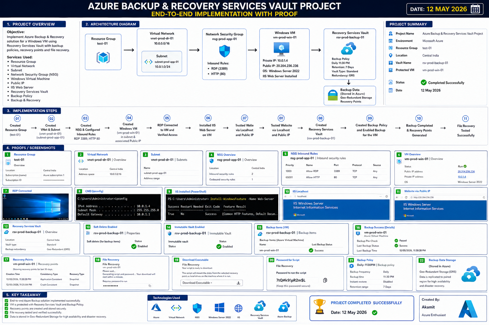

# Enterprise Azure Backup & Disaster Recovery Platform

## Executive Summary

Designed and implemented a production-ready Azure Backup & Disaster Recovery solution on Microsoft Azure using Azure Recovery Services Vault, Azure Virtual Machines, Azure Backup Policies, IIS Web Server, and Network Security Groups (NSG).

This project demonstrates enterprise-grade infrastructure protection, recovery validation, secure administration, and disaster recovery operations aligned with modern cloud operations practices.

---

# Project Architecture & Implementation



---

# Technologies Used

| Technology | Purpose |
|---|---|
| Microsoft Azure | Cloud Platform |
| Azure VM | Workload Hosting |
| Windows Server 2022 | Operating System |
| IIS Web Server | Web Hosting |
| Azure Backup | VM Protection |
| Recovery Services Vault | Backup Management |
| NSG | Infrastructure Security |
| Azure VNet | Networking |
| PowerShell | Administration |
| RDP | Secure Remote Access |

---

# Core Implementation Areas

## Infrastructure Deployment

- Azure Virtual Machine Deployment
- Virtual Network Configuration
- Subnet Configuration
- NSG Security Rules
- Public IP Configuration

## IIS Web Server Deployment

Installed IIS Web Server using PowerShell:

```powershell
Install-WindowsFeature -Name Web-Server -IncludeManagementTools
```

## Backup & Disaster Recovery Configuration

Configured:

- Recovery Services Vault
- Geo-Redundant Storage (GRS)
- Soft Delete Protection
- Immutable Vault
- Scheduled Backup Policies
- Recovery Point Validation

## File Recovery Testing

Performed successful:

- Restore Point Validation
- Recovery Executable Generation
- File Recovery Operations
- Backup Verification Testing

---

# Challenges & Solutions

| Challenge | Solution |
|---|---|
| RDP connection issue | Configured NSG inbound rule for Port 3389 |
| IIS inaccessible publicly | Configured HTTP inbound rule for Port 80 |
| Backup validation confusion | Verified recovery points manually |

---

# Technical Skills Demonstrated

- Azure Backup
- Recovery Services Vault
- Azure VM Administration
- Azure Networking
- NSG Configuration
- Disaster Recovery Planning
- Infrastructure Security
- Windows Server Administration
- PowerShell Automation
- IIS Deployment
- Backup Validation
- Production Troubleshooting

---

# Project Outcome

Successfully implemented a production-ready Azure Backup & Disaster Recovery environment capable of:

- Protecting production workloads
- Generating secure recovery points
- Performing file recovery operations
- Hosting IIS web applications
- Securing infrastructure access
- Supporting ransomware-resistant backup retention
- Enabling disaster recovery workflows

---

# Author

## Amit Kumar

### GitHub
https://github.com/Akamitt009
